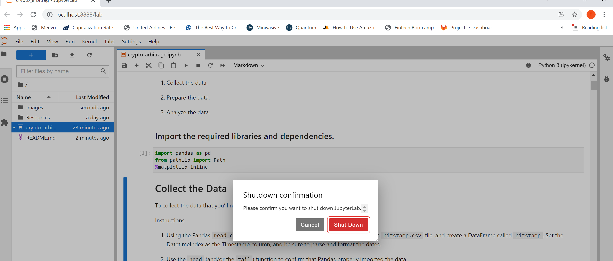

# Crypto Arbitrage Analysis Project

Many times pricing discrepancies can exist for the same asset on two different exchanges, providing an arbitrage opportunity to simultaneously buy the asset on the lower priced exchange and sell the asset on the higher priced exchange. Using Python in conjunction with the power of Pandas and JupyterLab, we can quickly and efficiently identify these price dislocations and make executable trade decisions.

The purpose of the crypto arbitrage analysis project is to apply the following three-phase process to analyze arbitrage opportunities and trends for Bitcoin cryptocurrency between two exchanges, Bitstamp and Coinbase, for the period January 1, 2018 to March 31, 2018:

- Collect data
- Prepare the data
- Analyze the data
 
The visualizations generated from the 'Analyze Data' phase should allow us to produce an analysis report describing the key assumptions, trends, and discoveries and which will consequently aid in the decision-making process. 

The datasets and variables in the notebook can be customized to perform analyses on other arbitrage opportunities.


---

## Technologies

The crypto arbitrage analysis leverages Python 3.8+ and utilizes the following project libraries and dependencies:
* [JupyterLab](https://jupyterlab.readthedocs.io/en/stable/) - a single integrated development environment (IDE) that allows you to write and run Python programs and review the results in one place
* [Pandas](https://pandas.pydata.org/) - a software library designed for open source data analysis and manipulation
- [matplotlib](https://matplotlib.org/) - library for creating visualizations in Python
- pathlib


---

## Installation Guide


Download Anaconda for your operating system and the latest Python version, run the installer, and follow the steps. Restart the terminal after completing the installation. Detailed instructions on how to install Anaconda can be found in the [Anaconda documentation](https://docs.anaconda.com/anaconda/install/).


---

## Usage
The crypto arbitrage analysis is hosted on the following GitHub repository at: https://github.com/nguyenthuyt/crypto_arbitrage   

### **Run instructions:**
To run the crypto arbitrage analysis, simply clone the repository or download the files and launch the **crypto_arbitrage.ipynb** in JupyterLab

To launch JupyterLab, follow these steps:

In your open terminal window (Terminal for macOS or Git Bash for Windows), navigate (`CD`) to the repo directory and then confirm that the term (dev) appears at the beginning of your command prompt. Type:
```python
conda activate dev
```

Then type: 
```python
jupyter lab
```

An instance of the JupyterLab user interface automatically opens in your browser. On the left-hand side menu, double-click the **crypto_arbitrage.ipynb** file to open the notebook.


Navigate to **'Run'** on the menu bar and select **'Run All Cells'** from the drop-down menu. Otherwise, run each individual cell with ctrl+enter.


If running each cell individually, first run the cell to import the required libraries and dependencies: 


### **Step 1: Collect the data**
Before using, it is required to load market data. Use the following code to load the CSV files to a DataFrame (df), ensure the CSV path is correct and run the code:

`df = pd.read_csv(Path("*insert file path here.csv*"), index_col="Timestamp", parse_date=True, infer_datetime_format=True)`

In this analysis we are loading historical Bitcoin data files for Bitstamp and Coinbase which are located in the Resources folder as 'bitstamp.csv' and 'coinbase.csv', respectively. 


To confirm the data was imported properly, use the head and/or tail function to review the data:

`display(df.head())`

`display(df.tail())`


### **Step 2: Prepare the data**
Rarely are datasets loaded in perfectly. Many times datasets need to be cleaned for missing, duplicate, and/or non-numerical data. To prepare and clean the data for analysis: 

- First, identify whether NaN or missing values exist, by typing `df.isnull().sum()`. If NaN values exist, type `df.dropna()` to drop all NaN values. 

- Second, if non-numerical values exist within a numerical dataset such as a dollar sign in the "Close" price column, then use the str.replace function to remove the dollar signs from the values in the Close column. `df.loc[:,'Close'].str.replace("$","")`

- Third, type `df.dtypes` to confirm whether numercal values are assigned the incorrect data type such as the "Close" column set as an object. Convert the data type of the "Close" column to a float by typing `df.[:,"Close"].astype`.

- Finally, review the data for duplicated values by typing `df.duplicated().sum()` and drop them if necessary by typing `df.drop_duplicates()`.

 - Repeat the steps, as needed.

### **Step 3: Analyze the data**

In this phase, graphical visualizations along with data statistics will be generated to analyze the data for potential arbitrage opportunities. The matplotlib dependency is utilized here to plot the data visualization. Based on the resulting visualizations, you can evaluate how the spread has changed between the two exchanges over time. 

*(Detailed instructions for completing the third phase: Analyze the data can be found in the **crypto_arbitrage.ipynb** file.)*

- First, begin with a big picture-view to gain a general understanding of the data before performing arbitrage calculations. You complete this by performing the following:
    - Choose the columns of data on which to focus your analysis using the `loc` function.
    - Then, generate summary statistics for each DataFrame with `df.describe()`
    - Then, create an overlay plot that visualizes the price action of both DataFrames using `df.plot()` defining figsize, legend, color, and label. See resulting line graph below:


- Second, select three specific points of reference for a more detailed analysis: (1) early date (2) middle date and (3) later date. With these three dates you will:
    - Generate summary statistics for each date
    - Create an overlay plot visualizing the two DataFrames over each date
    - Calculate the arbitrage spread by subtracting the lower price exchange from the higher price exchange
    - For each of the dates, narrow down the trading opportunities by determining the number of times positive trades exceeded 1% or the cost of trading
    - Calculate the potential profits for each of the dates using the formula: spread returns > 1% x purchase price
    - Use the `df.sum()` and `df.cumsum()`functions to calculate the potential arbitrage profits
    - Plot each of the results from the profit per trade and `cumsum` 


### **Final analysis report:**
Once all three phases are completed and the summary statistics and supporting visualizations have been generated, summarize your key assumptions, findings, and conclusions. In the case of the crypto arbitrage analysis, profitable arbitrage opportunities for Bitcoin between Bitstamp and Coinbase were significant but short-lived as time progressed. As arbitrage opportunities were exploited, the prices in the cheaper exchange went up and the prices in the more expensive exchange went down, ultimately resulting in the prices syncing up and consequently, the profits disappearing.


### **Quit instructions:**
After saving the file, from the menu bar, navigate to **'File'**, select **'Shutdown'** from the drop-down menu and confirm Shut Down.




In your open terminal window, deactivate the dev environment by typing:
```python
conda deactivate
```

---

## Contributors

The crypto arbitrage analysis was created as part of the Rice Fintech Bootcamp 2022 Program by:

Thuy Nguyen

Email: nguyen_thuyt@yahoo.com

LinkedIn: nguyenthuyt


---

## License

MIT

